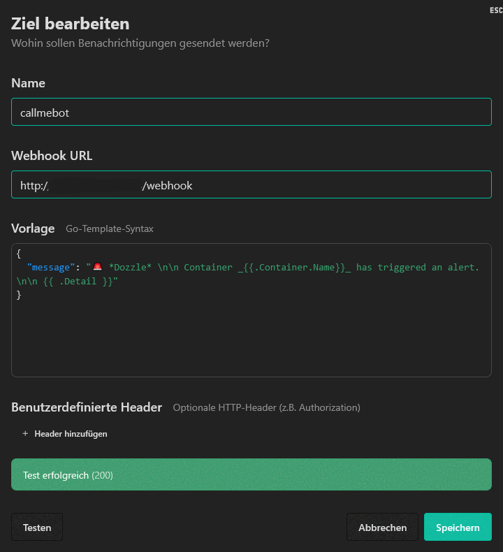

# Dozzle → CallMeBot Gateway

A small Docker web service that receives Dozzle webhooks and forwards them to CallMeBot.

Supports multiple messaging apps:
- WhatsApp
- Telegram
- Facebook Messenger
- Signal

---

# ✨ Features

- A single endpoint: `/webhook`
- Multi-service selection via `.env`
- Docker-ready
- Easy integration with Dozzle

---

# 🚀 Installation

## 1. Configure `.env`

```env
PORT=3000

CALLMEBOT_SERVICE=whatsapp

CALLMEBOT_WHATSAPP_PHONE=49123456789
CALLMEBOT_WHATSAPP_APIKEY=xxxxx

CALLMEBOT_TELEGRAM_CHATID=123456789
CALLMEBOT_TELEGRAM_APIKEY=xxxxx

CALLMEBOT_FACEBOOK_USERID=123456789
CALLMEBOT_FACEBOOK_APIKEY=xxxxx

CALLMEBOT_SIGNAL_PHONE=49123456789
CALLMEBOT_SIGNAL_APIKEY=xxxxx
```

## 2. Setting up Dozzle

To send notifications from Dozzle to the CallMeBot webhook, create a new destination under **Notifications → Webhooks**.

### Sample configuration



| Field | Value |
|--------|--------|
| Name | `callmebot` |
| Webhook URL | `http://<your-server>:<port>/webhook` |
| Template | See example below |

### Template

```json
{
  “message”: “🚨 *Dozzle* \n\n Container _{{.Container.Name}}_ has triggered an alert.\n\n {{ .Detail }}”
}
```

### Optional: Custom Headers

If your webhook requires authentication, additional headers can be specified.

Example:

| Header | Value |
|----------|----------|
| Authorization | Bearer YOUR_TOKEN |

### Test connection

Click **Test**. If the connection is successful, the following message will appear:

```text
Test successful (200)
```

Then save the configuration by clicking **Save**.

### Create an alert rule

1. Open **Notifications → Alert Rules**
2. Create a new rule or edit an existing one
3. Under **Notifications**, select the webhook you created earlier
4. Define conditions for the alert (logs, restarts, status changes, etc.)
5. Save the rule

As soon as an alert is triggered, Dozzle sends the message to the configured webhook.

